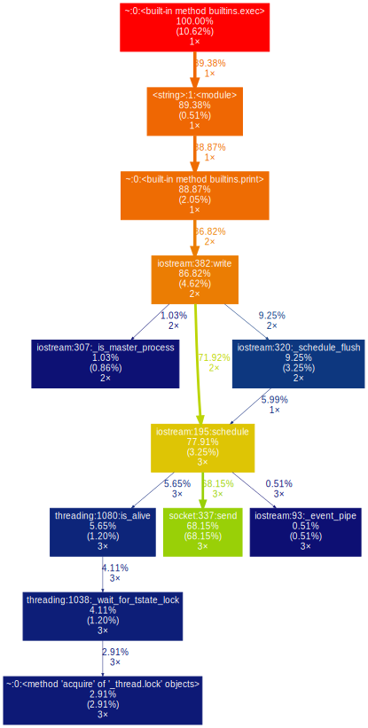

# gprof2dot_magic
Magic function for gprof2dot to profile any statement as a DOT graph


# installation
Make sure you've the Python package `gprof2dot_magic`.

```
pip install gprof2dot_magic
```

Its dependencies `gprof2dot` and `graphviz` will be installed as well

# usage
To enable the magic function, first load the `gprof2dot_magic` module

```python
%load_ext gprof2dot_magic
```

and then profile any line statement as a DOT graph as such:

```python
%gprof2dot print('hello world')
```



